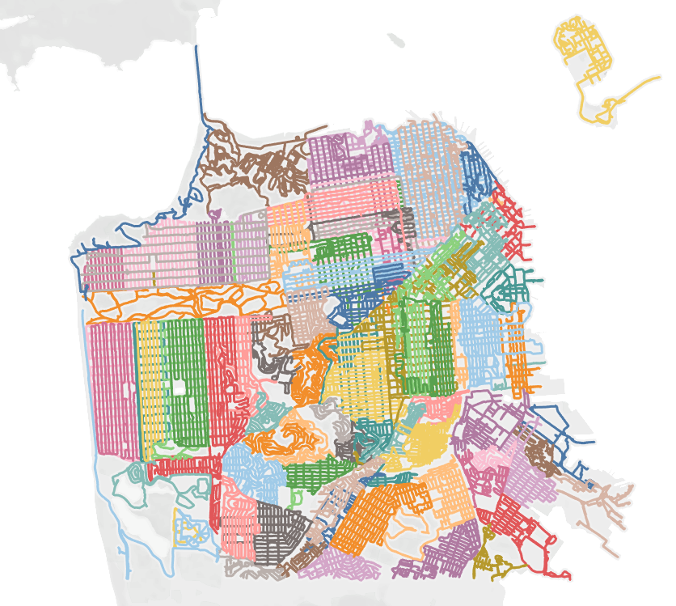
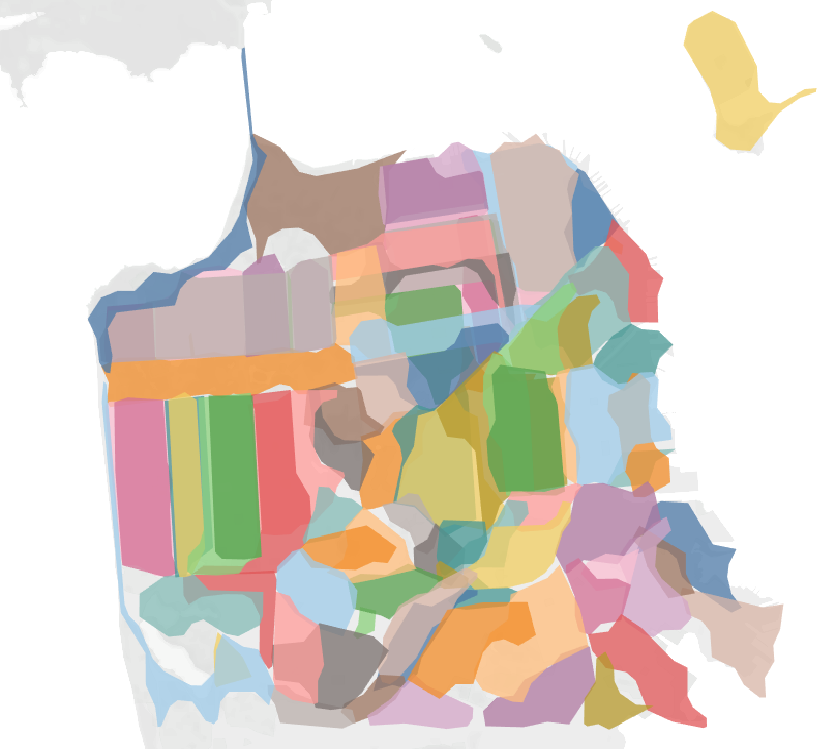
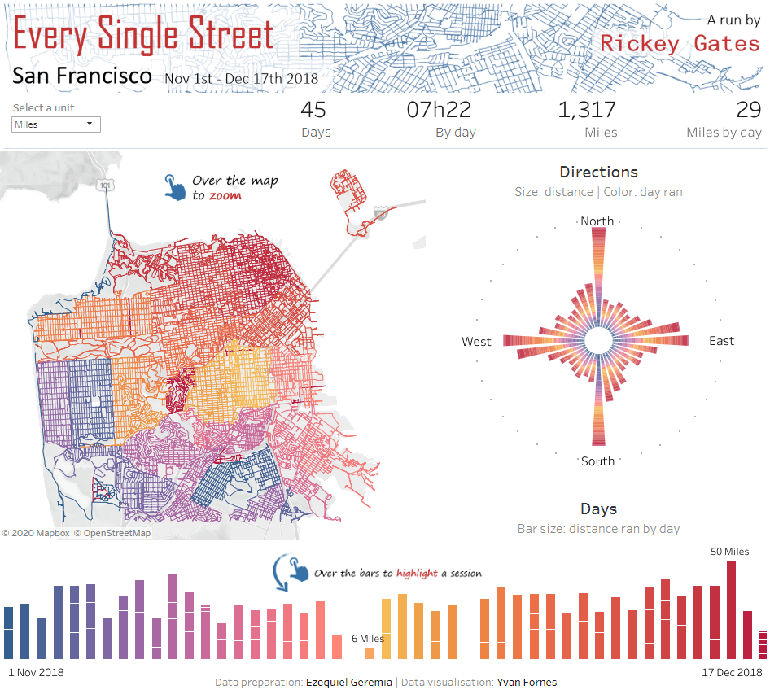

# Every Single Street Data Preparation.

`prepare.py` (Python 3.7) contains functions to ingest, compress and enrich GPX files. We assume that files store individual sessions (1 file = 1 session).
These tools were developed to ingest GPX traces of [Rickey Gates](https://www.rickeygates.com/)'s running sessions for his project [Every Single Street](https://www.everysinglestreet.com/why).
To do so, we build on [`gpxpy`](https://github.com/tkrajina/gpxpy) and [`shapely`](https://github.com/Toblerity/Shapely) libraries.

From input `.gpx` or `.gpx.xml` files, `prepare.py` can generate two types of output, both in CSV format:
* the **Point** data set which is a compressed sample of the input trace with additional features:
  | Field                   | Aggregation               | Origin   |
  | ----------------------- | ------------------------- | -------- |
  | `time`                  | point                     | GPX file |
  | `latitude`              | point                     | GPX file |
  | `longitude`             | point                     | GPX file |
  | `elevation`             | point                     | GPX file |
  | `heart_rate`            | point                     | GPX file |
  | `session_id`            | session                   | GPX file |
  | `distance`              | session                   | computed |
  | `duration`              | session                   | computed |
  | `bearing`               | point                     | computed |
  | `elevation_angle`       | point                     | computed |
  | `elevation_diff`        | point                     | computed |
  | `instantaneous_speed`   | point                     | computed |
  | `cumulative_downhill`   | session up to point       | computed |
  | `cumulative_uphill`     | session up to point       | computed |
  | `cumulative_distance`   | session up to point       | computed |
  | `cumulative_duration`   | session up to point       | computed |
  | `rolling_average_speed` | session up to point       | computed |
  
  which could be visualized like this ;
  
* the **hull** data set which provides the area covered by every running session:
  | Field        | Notes                                       |
  | ------------ | ------------------------------------------- |
  | `session_id` |                                             |
  | `vertex_id`  | Position of the vertex in the area polygon. |
  | `latitude`   | Vertex latitude.                            |
  | `longitude`  | Vertex longitude.                           |
  
  which could be visualized like this .
 
The **Point** data set was used by [Yvan Fornes](https://www.tableau.com/about/blog/contributors/yvan-fornes) to design this [Tableau](https://www.tableau.com/) visualization:
.
